<div align="center">

<picture>
  <source media="(prefers-color-scheme: dark)" srcset="public/jazym-logo-dark.webp" />
  
</picture>

### Bilingual cash-on-delivery store for teachers' stationery in Algeria

Personalised teacher notebooks, classroom organisers and pedagogical strategy kits,<br />
ordered in French or Arabic and paid in cash on delivery across all 69 wilayas.


-3178C6?logo=typescript&logoColor=white)


**Designed and built by Alaa Younsi**

</div>

---

## Contents

- [Overview](#overview)
- [Screenshots](#screenshots)
- [Design concept](#design-concept)
- [Features](#features)
- [Tech stack](#tech-stack)
- [Security](#security)
- [Performance](#performance)
- [SEO](#seo)
- [Local development](#local-development)
- [Credits](#credits)
- [License](#license)

## Overview

**Jazym** is an Algerian brand that makes stationery for teachers: daily lesson
journals, grade books, attendance registers, training and seminar notebooks —
most of them personalised with the teacher's name and subject — plus desk
organisers and hands-on "strategy" kits used to run classroom activities.

This repository is the complete commerce platform behind the brand:

- a **storefront** in French and Arabic (full right-to-left layout), built
  around the cash-on-delivery model that dominates Algerian e-commerce, with
  delivery priced per wilaya and per method (home or relay office);
- an **admin dashboard** where the owner and their staff run the catalogue,
  orders, delivery prices, promotions, marketing pixels and site content,
  each staff member limited to the sections they are allowed to see;
- a **Supabase backend** where every price, discount, delivery fee and stock
  movement is computed and enforced in the database.

## Screenshots

### Desktop

| Home | Home — Arabic (RTL), dark theme |
| :---: | :---: |
| 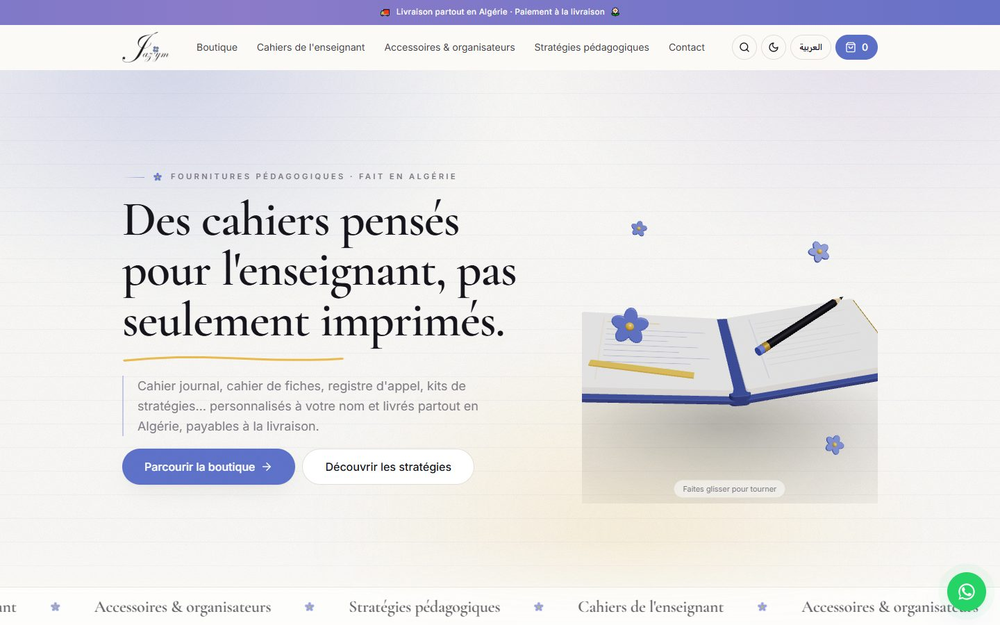 | 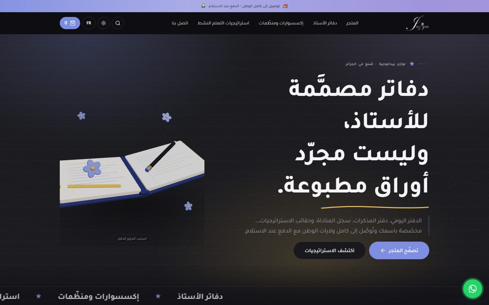 |
| **Categories & promo panel** | **Category page** |
| 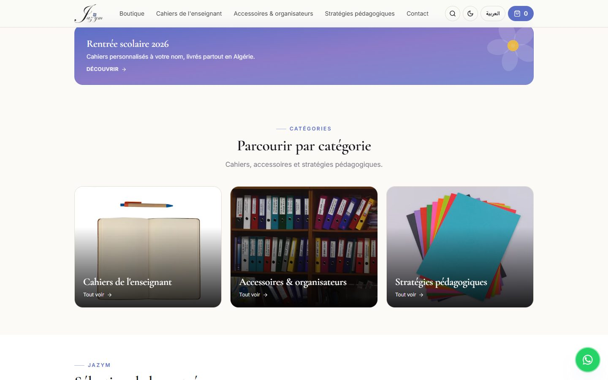 | 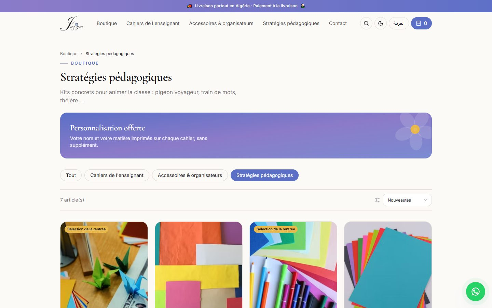 |
| **Product page** | **Checkout** |
| 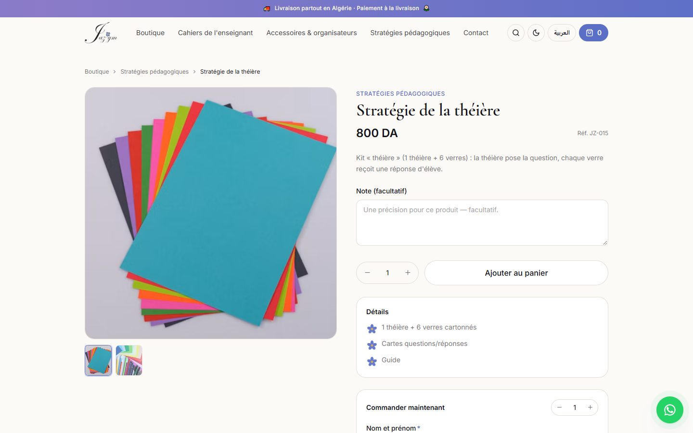 | 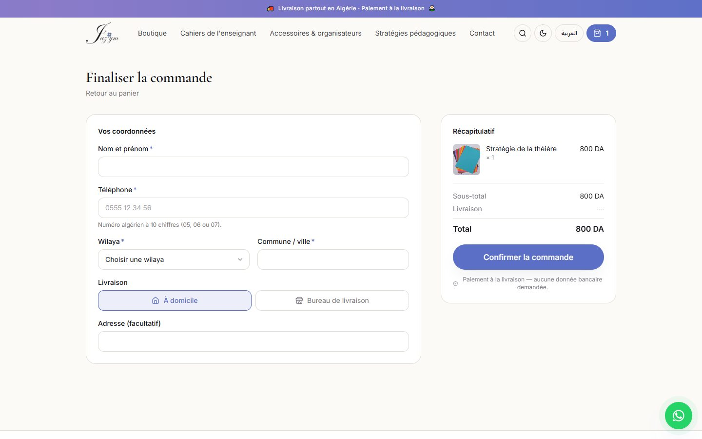 |

### Mobile

| Home | Arabic, dark theme | Category |
| :---: | :---: | :---: |
| 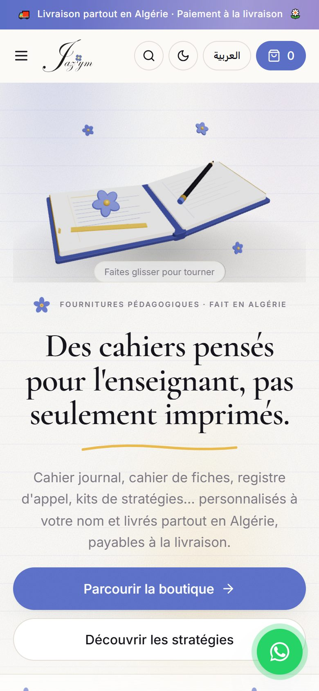 | 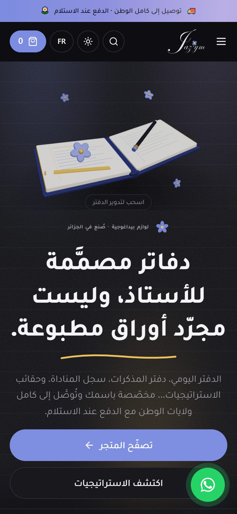 | 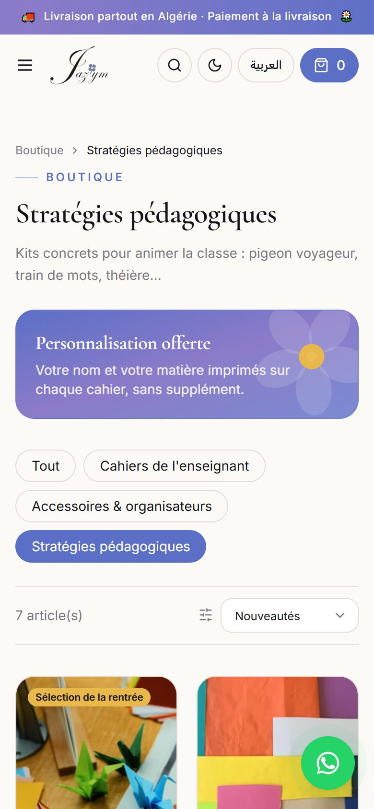 |
| **Product** | **Cart** | **Checkout** |
| 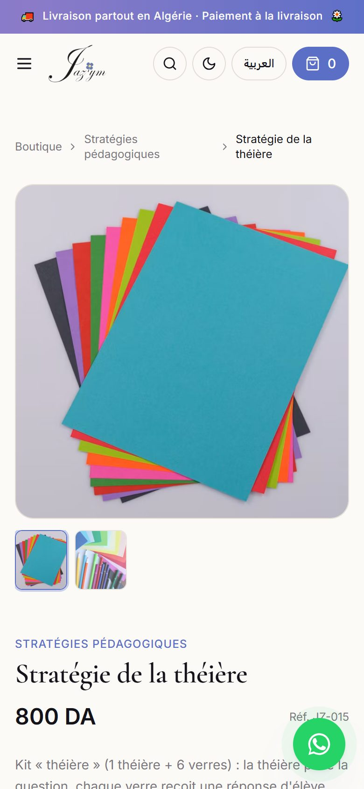 | 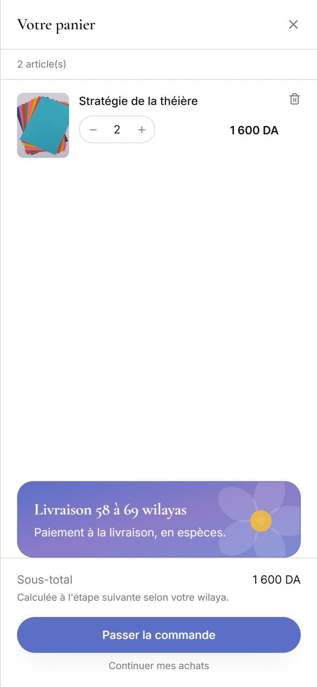 | 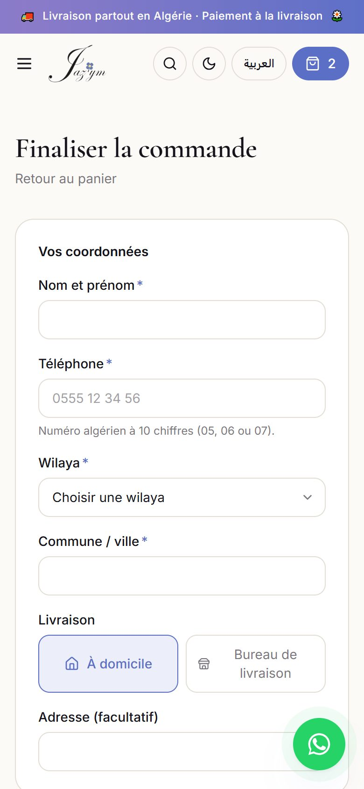 |

## Design concept

The brand sells notebooks to teachers, so the site is designed to feel like
**one of those notebooks** instead of a generic shop template.

- **The exercise book as a visual language.** Faint horizontal ruling, a soft
  paper-grain texture, page corners that lift on hover and a hand-drawn gold
  underline beneath the headline all come from the physical product.
- **An interactive 3D notebook in the hero.** A notebook built in three.js,
  with cover boards, a rounded spine, a gilt page edge, a pencil and flowers
  from the logo, turns slowly on its own. Visitors can drag it to rotate it.
  A flat SVG version is drawn first, so the page never waits on WebGL.
- **A palette taken from the logo.** Cornflower blue `#5B6FC7`, gold
  `#E8B84B`, cream paper `#FBFAF7` and ink `#14131A`. The logo's five-petal
  flower is reused as the list bullet, section marker and panel ornament.
- **Editorial typography.** *Cormorant Garamond* for display text, *Inter* for
  French body copy and *Tajawal* for Arabic, so each script uses a typeface
  drawn for it.
- **Two languages, two themes.** Switching between French and Arabic mirrors
  the whole layout, including icons, carousels and drawers. Light and dark
  themes are applied before the first paint, so there is no flash on load.
- **Motion used with restraint.** Staggered headline reveals, scroll-in
  sections, a category marquee and a swipeable product gallery. All of it
  respects the visitor's *reduce motion* setting.

## Features

### Storefront

- Nested catalogue: category → subject → theme → product.
- Product variants (page count, school level, personalisation), each with its
  own **price and stock**.
- Personalisation per item: the teacher's name printed on the notebook, an
  optional **custom cover image upload** and a free-text note.
- Two ways to order: a cart drawer, or an inline *order now* form on the
  product page.
- Cash-on-delivery checkout: validated Algerian phone numbers, all
  **69 wilayas**, and a choice between home delivery and relay-office pickup.
- A **promotions engine** covering *buy X get Y*, *buy X for N% off*,
  percentage off a category for a date window, and fixed-price bundles.
- Admin-managed promo panels and announcement bar, plus **free downloadable
  samples** (PDF, images, video) attached to a panel.
- Search, sorting, filters, related products, customer reviews, a floating
  WhatsApp contact button and editable policy pages.

### Admin dashboard

- Dashboard with orders, pending orders, revenue, active products and low-stock alerts.
- **Products**: images, variants, stock, video and personalisation options.
- **Categories**: nested tree with subcategories and custom display order.
- **Orders**: status board, per-status sections, quick status changes,
  manual order entry, internal notes and Excel export.
- **Delivery prices**: per wilaya and per delivery method, each wilaya can be
  switched on or off.
- **Promotions**, **promo panels**, **announcement bar**, **reviews**,
  **custom landing pages** (block editor) and **policy text**.
- **Marketing pixels**: several Meta and TikTok pixels, managed from the
  dashboard (Google Analytics 4 optional via environment variable).
- **Team**: staff accounts with per-section permissions, enforced by the
  database and not only by the interface.
- **Email notifications** for new orders.

## Tech stack

| Layer | Technology |
| --- | --- |
| Frontend | React 19, TypeScript (strict), Vite 8, React Router 6 |
| Styling | Tailwind CSS 3, self-hosted fonts via `@fontsource` |
| Motion & 3D | Framer Motion, three.js with `@react-three/fiber` |
| State & data | TanStack Query 5, Zustand 5 (persisted cart) |
| Forms | react-hook-form + zod |
| Backend | Supabase: PostgreSQL, Auth, Storage, Row-Level Security, SQL RPCs |
| Server code | Supabase Edge Functions (Deno), Vercel Edge Middleware |
| Email | Resend |
| Tooling | Bun, Biome (lint + format), PGlite (in-process Postgres for tests) |
| Hosting | Vercel |

## Security

- **Prices are never trusted from the browser.** Orders are placed through a
  single database function, `place_order`, which recalculates every unit
  price, variant price, promotion, delivery fee and total from the database.
  The browser only sends product IDs, quantities and selections.
- **Stock is checked safely in the database.** Demand is summed per product
  and variant before anything is written, and a `stock >= 0` constraint means
  no code path can oversell.
- **Abuse protection at checkout.** Orders are rate-limited per phone number
  (burst and daily), and a global circuit breaker caps order volume. Errors are
  returned as stable codes, which the site translates into French and Arabic.
- **Row-Level Security on every table.** Anonymous visitors can read only
  public catalogue data. Staff permissions are checked per admin section inside
  Postgres policies, so a hidden menu item is not the only barrier.
- **Service-role keys stay on the server.** Actions that need elevated
  rights, such as creating staff accounts, resetting passwords and sending
  emails, run in Edge Functions that check the caller's permissions first. The
  browser only ever has the public anon key.
- **Customer uploads are hardened.** Images are decoded and re-encoded through
  a canvas before upload, and anything that fails to decode is rejected. The
  bucket is capped at 5 MB, and the server checks that every submitted file
  URL points into the project's own bucket.
- **Strict HTTP headers.** The Content Security Policy has no
  `'unsafe-inline'` scripts: the one inline pre-paint script is allowed by its
  SHA-256 hash. HSTS with preload, `nosniff`, a locked-down Permissions-Policy
  and `frame-ancestors 'self'` are also set.
- **Safe data export.** The Excel order export neutralises spreadsheet
  formula injection.
- **Secrets stay out of the repository.** Keys are read only from environment
  variables, and `.env` files are git-ignored.
- **Tested pricing logic.** `bun run test:db` applies every migration to a
  fresh in-memory Postgres and checks that the SQL pricing engine and the
  TypeScript preview shown in the cart give identical totals.

## Performance

- **The 3D scene costs nothing up front.** The three.js chunk (~239 KB gzip)
  loads only once the browser is idle, and only on devices that can handle it:
  no *reduce motion* or *save data* setting, at least 4 CPU cores, working
  WebGL and, on phones, a 4G connection. Everyone else keeps the SVG
  illustration.
- **Small initial bundle.** Every route is code-split, and vendor code is
  divided into long-cached chunks (React, TanStack Query, Framer Motion,
  Supabase). The home page's own chunk is about 6 KB gzipped.
- **Responsive images.** Product images come from Supabase's image-rendering
  endpoint with `srcset` and `sizes`, with a fallback if a transform fails.
  Admin uploads are compressed in the browser before they are sent.
- **Fonts and caching.** Fonts are self-hosted and subset, with no
  third-party font requests. Hashed assets are served with
  `Cache-Control: immutable` for one year, and the page preconnects to
  Supabase.
- **Lightweight media.** Product videos use `preload="none"` and a poster
  frame, and are mounted only when they are shown.
- **Data that loads once.** Catalogue queries are cached by TanStack Query and
  not refetched every time the browser tab regains focus.

## SEO

- **Tags for every page.** Each route sets its own title, description,
  canonical URL, Open Graph and Twitter tags. Tags from the previous page are
  cleared on navigation.
- **Structured data.** A `Store` schema covers the site and a `Product` +
  `Offer` schema covers each product page, including price, currency and
  availability.
- **Link previews for crawlers.** Social crawlers such as Facebook, WhatsApp,
  Telegram and X don't run JavaScript. A Vercel Edge Middleware therefore
  serves them each product's real title, description and image, so shared
  links show the product and not a generic card.
- **Generated sitemap and robots.txt.** Both are rebuilt from the live
  catalogue on every deploy, and cover every active product and category.
  `robots.txt` keeps the admin, checkout and order pages out of search.
- **Bilingual metadata.** The `fr_DZ` locale is declared, with `ar_DZ` as an
  alternate. Custom 1200×630 share image, full favicon set.

## Local development

Requires [Bun](https://bun.sh).

```bash
bun install
cp .env.example .env   # add the Supabase URL and anon key
bun run dev            # http://localhost:5173
```

Without Supabase keys, the store runs in **demo mode** with a built-in
catalogue and simulated orders.

| Command | Purpose |
| --- | --- |
| `bun run dev` | Development server |
| `bun run build` | Sitemap generation, type check and production build |
| `bun run typecheck` | TypeScript check |
| `bun run lint` | Biome lint + format check |
| `bun run test:db` | Migration + pricing-parity test suite (PGlite) |

The database schema lives in `supabase/migrations/` and is applied in numeric
order. The full production checklist (Supabase, Edge Functions, Vercel,
domain, pixels) is in [`HANDOFF.md`](HANDOFF.md).

## Credits

**Alaa Younsi** designed, architected and developed this project: the
visual identity and 3D hero, the storefront, the admin dashboard, the
database and its security model, the pricing and promotions engine, and
the deployment setup.

Built for the **Jazym** brand. The Jazym name and logo belong to their owner.

## License

**Copyright © 2026 Alaa Younsi. All rights reserved.**

This is proprietary software. It is shown here for portfolio and reference
purposes only. You may not copy, reuse, modify, distribute or build on any part
of it, in whole or in part, without prior written permission. See
[`LICENSE`](LICENSE) for the full terms.
